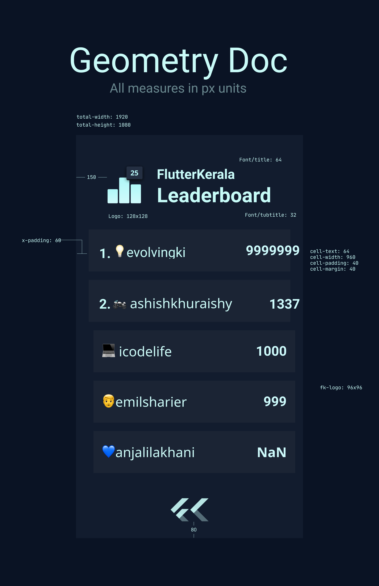

# [LeaderboardBot](https://t.me/fkleaderboardbot) for Telegram


**A leaderboard bot built for Flutter Kerala Telegram group's weekly challenge
using Teledart Telegram API Wrapper written in Dart 💙**

## Commands

| Command | Action |
|---------|--------|
| ```/panineerThaliAane``` | Kind of like Hello World but with an elephant and rose water |
 
#### Wanna Host Yourself? Ugh! Okay

1. Clone the bot locally
``` shell
  git clone https://github.com/FlutterKerala/LeaderBoardBot.git
```
2. Navigate to bin/ and open constants.dart in your editor of choice
``` dart
  class Constants {
    static String botKey = 'YOUR API KEY HERE'; // Bot token is moved to env variable [BOTTOKEN]
    static List<int> sudoUsers = ['Put your telegram user id'];
  }
```

3. In terminal run 
``` shell
  dart bin/main.dart
```

4. [And it begins](./caesar.png)

#### Leaderboard is created by parsing CSV & make sure you upload csv file with name as week[weeknumber].csv

#### Geometry for the leaderboard design

